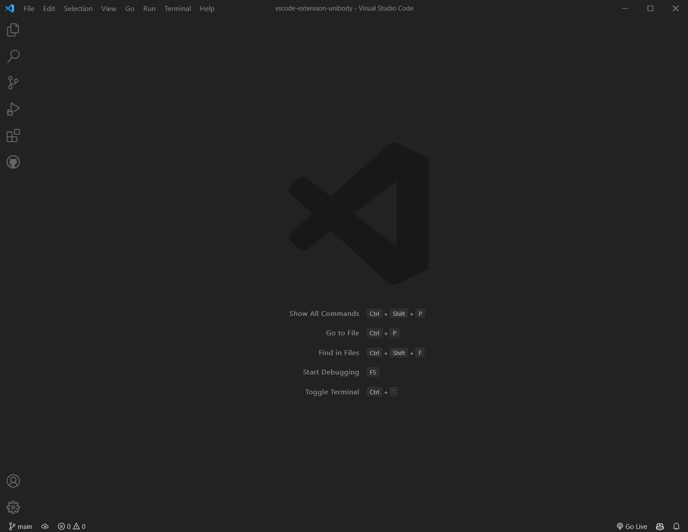

# Unibody

## Description

A dark theme extension for Visual Studio Code based on default dark theme.

## Installation

[Download](https://marketplace.visualstudio.com/items?itemName=YaoweiZou.unibody) from Microsoft Marketplace.

## Build

Require global install `vsce`.

```
cd vscode-extension-unibody
vsce package
```

## Changelog

[changelog](./CHANGELOG.md)

## Screenshots



[view all screenshots](./assets/screenshots)

## Contributing

- TokenColors from [Mohamed3nan](https://github.com/Mohamed3nan/jetbrains-darcula-theme).