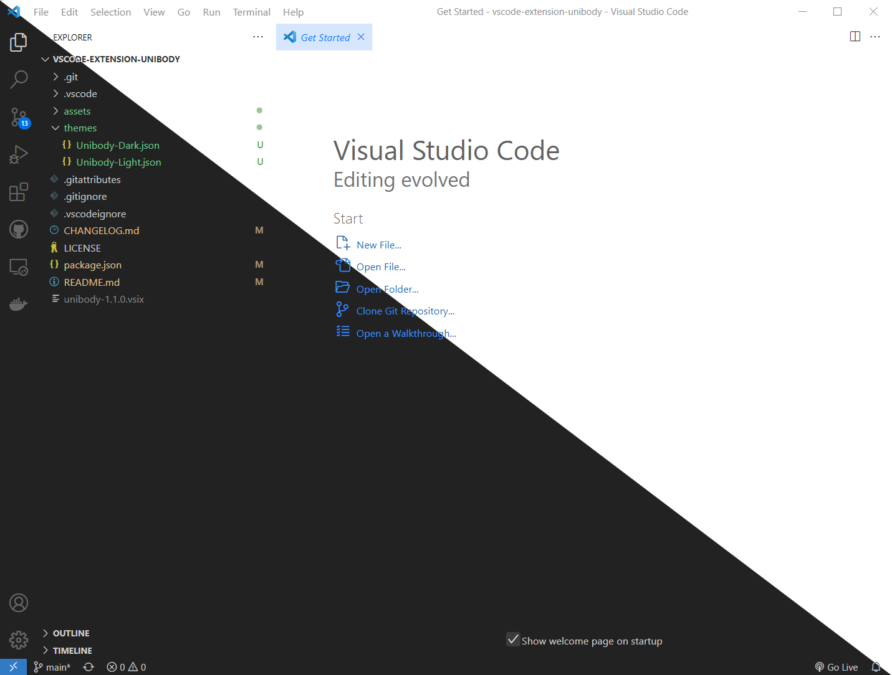

# Unibody

## Description

A theme extension for Visual Studio Code based on default theme.

## Installation

[Download](https://marketplace.visualstudio.com/items?itemName=YaoweiZou.unibody) from Microsoft Marketplace.

## Change log

[change log](./CHANGELOG.md)

## Screenshots



[view all screenshots](./assets/screenshots)

## Get up and running straight away

- Press `F5` to open a new window with your extension loaded.
- Open `File > Preferences > Color Themes` and pick your color theme.
- Open a file that has a language associated. The languages' configured grammar will tokenize the text and assign 'scopes' to the tokens. To examine these scopes, invoke the `Developer: Inspect Editor Tokens and Scopes` command from the Command Palette (`Ctrl+Shift+P` or `Cmd+Shift+P` on Mac) .

## Build

Require Node.js and global install `vsce`.

```
cd vscode-extension-unibody
vsce package
```

## Contributing

- TokenColors from [Mohamed3nan](https://github.com/Mohamed3nan/jetbrains-darcula-theme).