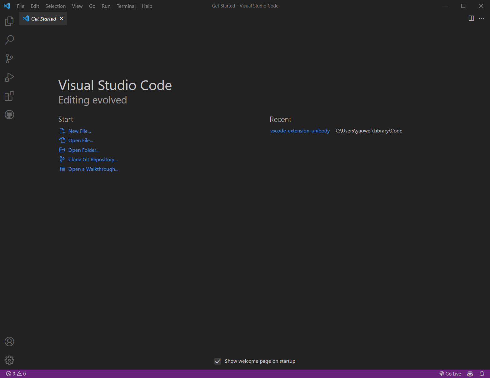
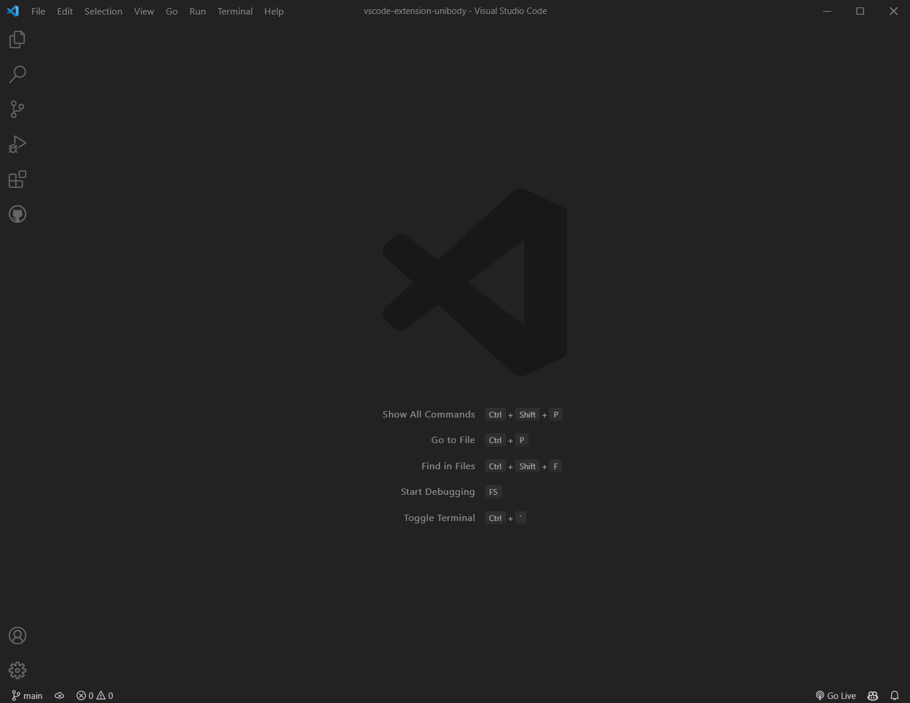
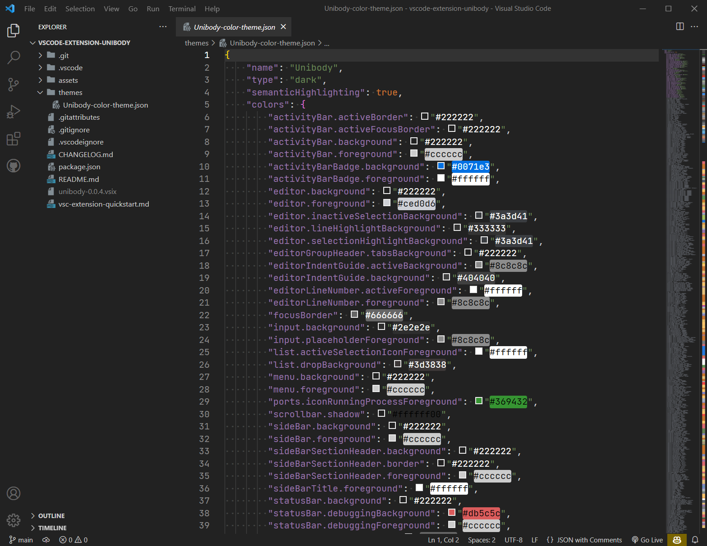

# Unibody

## Description

A theme extension for Visual Studio Code based on default dark theme.

TokenColors from <a link="https://github.com/Mohamed3nan/jetbrains-darcula-theme">Mohamed3nan</a>.

## Screenshots

nofolder



folder-1



folder-2



## Build
need global install `vsce`
```
cd vscode-extension-unibody
vsce package
```